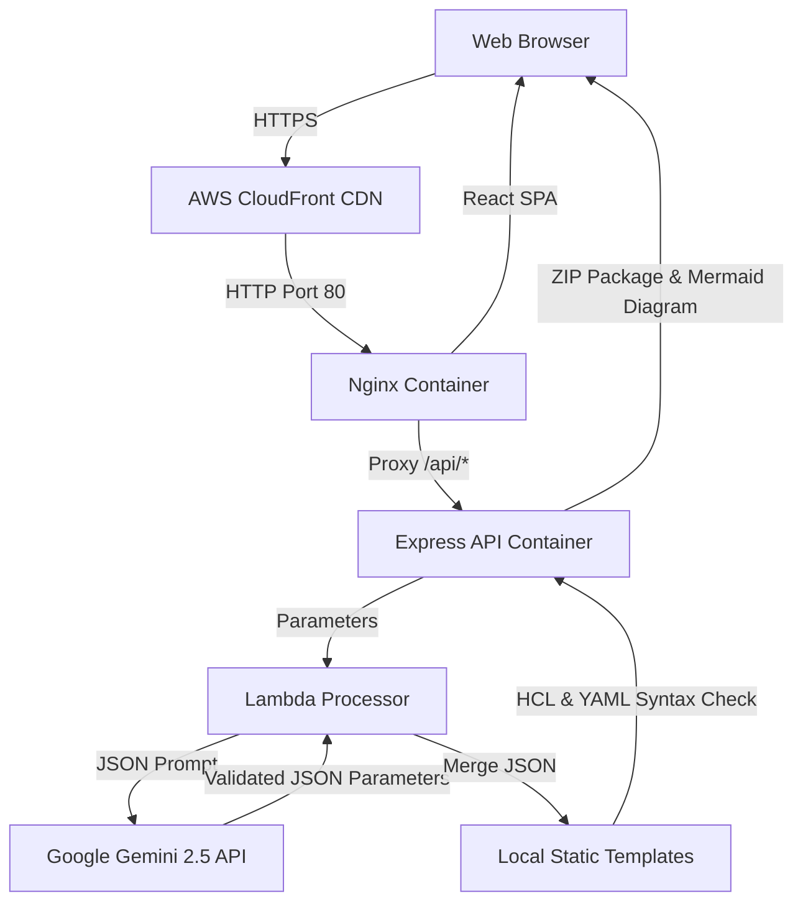

# TemplateOne Presentation Outline
**AI-Powered Cloud Architect Dashboard & Automated Provisioning Engine**

This document provides a slide-by-slide presentation structure, including slide titles, key bullet points, speaking notes, and visual diagram recommendations to help you present **TemplateOne** to stakeholders, recruiters, or technical teams.

---

## Slide 1: Title Slide (Introduction)
* **Title:** TemplateOne
* **Subtitle:** An AI-Assisted AWS Parameter Customizer & Automated Deployment Engine
* **Presenter:** [Your Name]
* **Tagline:** Bridging the gap between manual Cloud Architecture and automated, verified Infra-as-Code.
* **Visual:** Screenshot of the dark-themed dashboard homepage.

---

## Slide 2: The Problem
* **Slide Title:** The Challenges of Manual Cloud Provisioning
* **Bullet Points:**
  * **Syntax & Logical Errors**: Manual creation of Terraform (HCL) and CloudFormation (YAML) leads to frequent syntax bugs.
  * **Opacity in Cost Planning**: Estimating AWS costs dynamically during architecture drafting is disconnected from the code itself.
  * **AI Hallucinations**: Generative AI tools often hallucinate entire invalid Cloud manifests when asked to write full files.
  * **Complexity**: Deploying and keeping cloud configurations up to date across environments is time-consuming.

---

## Slide 3: The Solution
* **Slide Title:** Introducing TemplateOne
* **Bullet Points:**
  * **Hybrid AI-Parameter Merging**: Static, tested blueprints are maintained locally as a single source of truth; Google Gemini 2.5 only customizes parameters (instance types, sizes, names, costs).
  * **Interactive Cost Playground**: Users adjust resources with real-time parametric sliders to compare active costs before provisioning.
  * **Live Architecture Blueprints**: Automatically generates interactive, visual flowcharts using Mermaid.js.
  * **Post-Merge Verification**: Strict schema check (`Zod`), HCL/YAML syntax checks, and regex scanner to ensure zero template placeholders remain.

---

## Slide 4: Key Features & Demo
* **Slide Title:** Core Capabilities
* **Bullet Points:**
  * **Multi-Format Export**: Customizes and packages configurations into `Terraform`, `CloudFormation`, `Kubernetes`, and `Docker Compose` manifests in one click.
  * **Free-Tier Safe Mode**: Restricts customized parameters strictly to AWS Free Tier boundaries (`t2.micro`, single AZs) to guarantee zero active monthly hosting fees.
  * **ZIP Download**: Instantly bundles all customized scripts and configurations into a downloadable zip file.
  * **Structured Logs & Debugging**: Centralized logging using unique Request IDs to track prompt and validation statuses.

---

## Slide 5: System Architecture
* **Slide Title:** System Architecture & Data Flow
* **Visual (Mermaid Diagram):**

* **Speaking Notes:** "The user interacts with the React app served by Nginx. API requests go through Nginx to the Express container, which invokes our serverless-ready Lambda logic. Gemini validates parameters which are safely merged into local static templates before validation."

---

## Slide 6: The Tech Stack
* **Slide Title:** Modern Technology Stack
* **Table:**

| Layer | Technology | Rationale |
| :--- | :--- | :--- |
| **Frontend** | React 19 (Vite), Tailwind CSS v3 | Highly performant SPA with responsive, premium CSS custom variables. |
| **Reverse Proxy** | Nginx | Serves static assets and securely handles `/api` reverse proxying. |
| **Backend API** | Node.js (22 LTS), Express | Handles CORS, request throttling (rate limiting), and in-memory LRU caching. |
| **AI Integration**| Gemini 2.5 API | Fast, cheap parameters customization with schema verification. |
| **Containerization**| Docker, Docker Compose | Consistent local and remote runtimes. |
| **Hosting & CI/CD** | AWS EC2 (t3.micro), GitHub Actions | Cloud distribution via GitHub CD runners over SSH. |

---

## Slide 7: Technical Resilience & Error Handling
* **Slide Title:** High Reliability Engineering
* **Bullet Points:**
  * **Schema Validation (`Zod`)**: Enforces strict JSON types returned from Gemini.
  * **Timeout Protection**: Aborts hanging API calls after 20 seconds.
  * **Automatic Retries**: Implements an automatic 2x retry loop for transient JSON parse failures.
  * **Mock Fallback Mode**: If the API key is missing or rate-limited, the system seamlessly triggers fallback mock parameters so the app never crashes.
  * **Structured JSON Logging**: All logs include a unique `requestId` for fast debugging.

---

## Slide 8: CI/CD & Cloud Deployment
* **Slide Title:** Automated GitOps Pipeline
* **Bullet Points:**
  * **Build-on-CI, Run-on-EC2**: Building Docker containers on small `t2.micro` instances causes memory exhaustion. We offload builds to GitHub Actions runners.
  * **Secure SSH Deployments**: GitHub Actions connects to the EC2 server via SSH using secrets, writes the composition, pulls compiled images, and boots them.
  * **Zero Downtime Updates**: Docker Compose updates the images in the background and swaps traffic seamlessly.

---

## Slide 9: Future Roadmap
* **Slide Title:** Next Steps & Enhancements
* **Bullet Points:**
  * **Template Versioning**: Supporting older/newer versions of architectures (e.g., Terraform-v1 vs Terraform-v2).
  * **Multi-Cloud Support**: Expanding customization options to Google Cloud Platform (GCP) and Microsoft Azure.
  * **User Authentication**: Allowing users to save, catalog, and share custom architectures.
  * **Direct AWS Deployment**: Integrating with AWS SDKs to allow users to deploy their customized templates directly to AWS from the dashboard.

---

## Slide 10: Conclusion & Q&A
* **Slide Title:** Questions & Answers
* **Bullet Points:**
  * Thank you for your time!
  * Live Site: `https://dqmersxcwo7a7.cloudfront.net`
  * GitHub Repo: `https://github.com/sapunjgogoi/TemplateOne`
